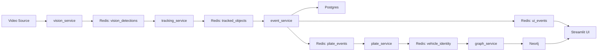
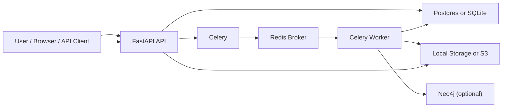
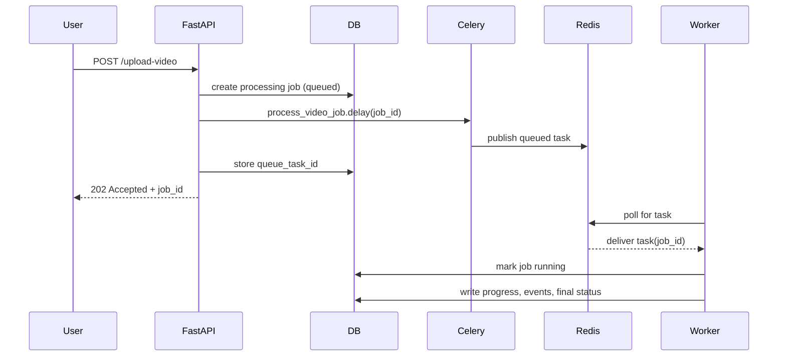
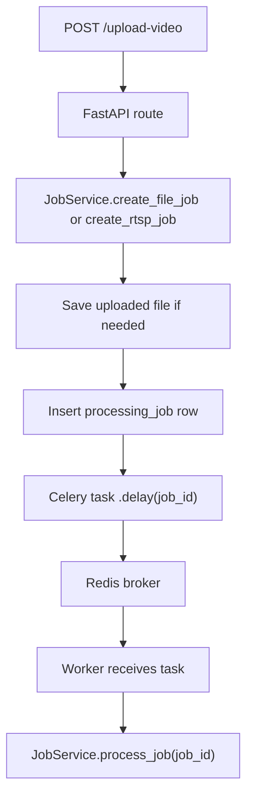
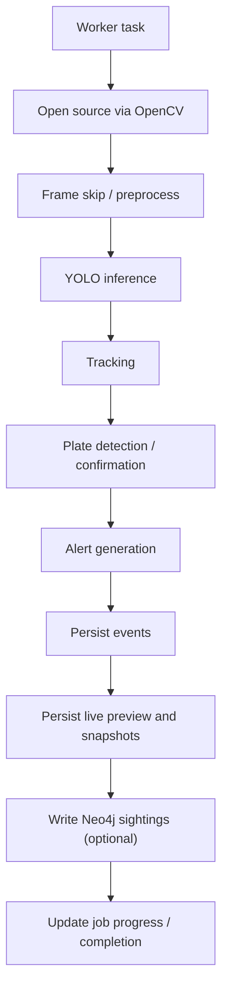
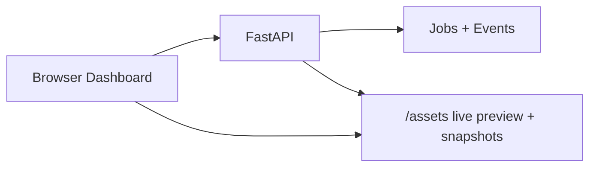

# Production Backend Architecture

This document explains the current production-oriented backend for the surveillance analytics system, how it differs from the original local multi-service pipeline, and how the major components interact.

## Purpose

The original project was built as a local surveillance analytics pipeline that used Redis streams to pass data between multiple Python services. The current backend refactor moves the system toward an AWS EC2 deployable architecture based on:

- FastAPI for the control plane and APIs
- Celery for background job execution
- Redis as the queue broker
- SQLAlchemy + Postgres/SQLite for durable metadata
- local or S3-compatible storage for videos and snapshots
- optional Neo4j for knowledge graph persistence

This refactor keeps the surveillance features, but changes the runtime model from service-to-service event streaming into a queue-and-worker architecture.

---

## Repository Context

Relevant legacy directories:

- [vision_service](/E:/Projects/Urban%20Traffic%20Intel%20System/traffic-ai-platform/vision_service)
- [tracking_service](/E:/Projects/Urban%20Traffic%20Intel%20System/traffic-ai-platform/tracking_service)
- [event_service](/E:/Projects/Urban%20Traffic%20Intel%20System/traffic-ai-platform/event_service)
- [plate_service](/E:/Projects/Urban%20Traffic%20Intel%20System/traffic-ai-platform/plate_service)
- [graph_service](/E:/Projects/Urban%20Traffic%20Intel%20System/traffic-ai-platform/graph_service)
- [ui](/E:/Projects/Urban%20Traffic%20Intel%20System/traffic-ai-platform/ui)

Relevant production backend directories:

- [backend/app](/E:/Projects/Urban%20Traffic%20Intel%20System/traffic-ai-platform/backend/app)
- [backend/Dockerfile](/E:/Projects/Urban%20Traffic%20Intel%20System/traffic-ai-platform/backend/Dockerfile)
- [backend/docker-compose.yml](/E:/Projects/Urban%20Traffic%20Intel%20System/traffic-ai-platform/backend/docker-compose.yml)
- [backend/.env.example](/E:/Projects/Urban%20Traffic%20Intel%20System/traffic-ai-platform/backend/.env.example)

---

## Old Architecture

### Legacy Design Goal

The original design separated the surveillance pipeline into multiple independent services. Each service consumed a Redis stream, did one part of the work, and published results to another Redis stream.

### Old Pipeline

```text
Video
  -> vision_service
  -> tracking_service
  -> event_service
  -> plate_service
  -> graph_service
  -> UI
```

### Old Responsibilities

- `vision_service`
  - frame ingestion
  - YOLO detection
  - publish detections to Redis
- `tracking_service`
  - consume detections
  - assign track IDs
  - publish tracked objects
- `event_service`
  - derive alerts such as stopped/speeding/congestion
  - write events to database
  - request plate recognition when needed
- `plate_service`
  - perform ANPR / plate confirmation
  - update DB with plate
  - publish confirmed vehicle identity
- `graph_service`
  - write sightings into Neo4j
- `ui`
  - read Redis + graph data for live display

### Old Redis Role

Redis was the real-time event bus between all services.

Examples from the legacy pipeline:

- `vision_detections`
- `tracked_objects`
- `plate_events`
- `ui_events`
- `vehicle_identity`

### Old Architecture Diagram



### Old Architecture Strengths

- highly modular
- easy to reason about stage boundaries
- close to streaming/microservice style

### Old Architecture Weaknesses

- many moving parts for a single deployment
- operational complexity
- Redis tightly coupled to every stage
- difficult to package as one production backend service
- harder to scale and debug on a single EC2 instance

---

## New Architecture

### New Design Goal

The refactor changes the system from a stream-chained local pipeline into a production-oriented backend:

- FastAPI handles requests and status APIs
- Celery workers process long-running video jobs
- Redis handles job queueing, not per-frame event streaming
- database and storage hold the durable outputs
- UI is served from the backend itself

### New Runtime Model

```text
Client / Dashboard
  -> FastAPI
  -> create job
  -> enqueue Celery task via Redis
  -> worker processes video
  -> DB / storage / Neo4j updated
  -> dashboard polls APIs for live state
```

### New Architecture Diagram



### New Responsibilities

- FastAPI
  - upload API
  - job APIs
  - events API
  - health API
  - dashboard UI
  - static asset serving for snapshots/live preview
- Celery
  - task abstraction for background jobs
- Redis
  - queue broker and result backend for Celery
- Worker
  - video processing loop
  - inference
  - tracking
  - alerts
  - ANPR
  - live preview generation
  - DB writes
  - optional graph writes
- Database
  - processing jobs
  - events
- Storage
  - raw uploaded videos
  - event snapshots
  - live preview image/state
- Neo4j
  - optional vehicle-camera-sighting graph

---

## Old vs New Comparison

| Area | Old Architecture | New Architecture |
|---|---|---|
| Control plane | multiple scripts | FastAPI |
| Background execution | chained services | Celery worker |
| Redis usage | per-stage event streaming | job queue broker |
| UI | separate Streamlit app | integrated backend dashboard |
| Persistence | mixed per-service writes | centralized DB/repository pattern |
| Deployment model | local service orchestration | Dockerized API + worker + Redis + DB |
| Best fit | local pipeline demo | EC2-oriented backend system |

### Key Conceptual Difference

Old:

```text
Redis carried the pipeline
```

New:

```text
Redis carries jobs
The worker carries the pipeline
```

---

## How FastAPI, Redis, and Celery Work Together

### Summary

- FastAPI accepts the upload request
- FastAPI creates a DB job row
- FastAPI asks Celery to enqueue the job
- Celery stores the task in Redis
- Worker receives the task from Redis
- Worker processes the video and writes results

### Interaction Diagram



### Code Locations

- API request entry:
  [backend/app/api/routes.py](/E:/Projects/Urban%20Traffic%20Intel%20System/traffic-ai-platform/backend/app/api/routes.py)
- job orchestration:
  [backend/app/services/jobs.py](/E:/Projects/Urban%20Traffic%20Intel%20System/traffic-ai-platform/backend/app/services/jobs.py)
- Celery worker:
  [backend/app/worker.py](/E:/Projects/Urban%20Traffic%20Intel%20System/traffic-ai-platform/backend/app/worker.py)
- Redis/Celery config:
  [backend/app/core/config.py](/E:/Projects/Urban%20Traffic%20Intel%20System/traffic-ai-platform/backend/app/core/config.py)

---

## End-to-End Processing Flow

### Upload Request Flow



### Worker Pipeline Flow



### Dashboard Flow



The dashboard does not talk to Redis directly. It polls FastAPI endpoints and image assets.

---

## Current Backend Structure

### App Boot

- [backend/app/main.py](/E:/Projects/Urban%20Traffic%20Intel%20System/traffic-ai-platform/backend/app/main.py)

Responsibilities:

- configure logging
- create tables from SQLAlchemy metadata
- initialize service container
- mount `/assets` for snapshots and live previews

### API Layer

- [backend/app/api/routes.py](/E:/Projects/Urban%20Traffic%20Intel%20System/traffic-ai-platform/backend/app/api/routes.py)

Current routes:

- `GET /`
- `GET /health`
- `POST /upload-video`
- `GET /jobs`
- `GET /jobs/{job_id}`
- `GET /jobs/{job_id}/live-state`
- `GET /events`

### UI Layer

- [backend/app/ui.py](/E:/Projects/Urban%20Traffic%20Intel%20System/traffic-ai-platform/backend/app/ui.py)

Current UI capabilities:

- upload video file
- submit RTSP source
- auto-refresh
- live job queue
- focused job detail
- recent event feed
- evidence gallery
- live annotated frame for focused job

### Config

- [backend/app/core/config.py](/E:/Projects/Urban%20Traffic%20Intel%20System/traffic-ai-platform/backend/app/core/config.py)

Handles:

- DB config
- Redis/Celery config
- storage config
- model config
- ANPR config
- graph config
- live snapshot config

### Logging

- [backend/app/core/logging.py](/E:/Projects/Urban%20Traffic%20Intel%20System/traffic-ai-platform/backend/app/core/logging.py)

Structured JSON logging for:

- inference timing
- detection metadata
- failures

### DB Models

- [backend/app/db/base.py](/E:/Projects/Urban%20Traffic%20Intel%20System/traffic-ai-platform/backend/app/db/base.py)
- [backend/app/db/models.py](/E:/Projects/Urban%20Traffic%20Intel%20System/traffic-ai-platform/backend/app/db/models.py)
- [backend/app/db/session.py](/E:/Projects/Urban%20Traffic%20Intel%20System/traffic-ai-platform/backend/app/db/session.py)

Main tables:

- `processing_jobs`
- `events`

### Repositories

- [backend/app/repositories/jobs.py](/E:/Projects/Urban%20Traffic%20Intel%20System/traffic-ai-platform/backend/app/repositories/jobs.py)
- [backend/app/repositories/events.py](/E:/Projects/Urban%20Traffic%20Intel%20System/traffic-ai-platform/backend/app/repositories/events.py)

Used to isolate DB access from route logic.

### Services

- [backend/app/services/video_ingestion.py](/E:/Projects/Urban%20Traffic%20Intel%20System/traffic-ai-platform/backend/app/services/video_ingestion.py)
- [backend/app/services/frame_pipeline.py](/E:/Projects/Urban%20Traffic%20Intel%20System/traffic-ai-platform/backend/app/services/frame_pipeline.py)
- [backend/app/services/inference.py](/E:/Projects/Urban%20Traffic%20Intel%20System/traffic-ai-platform/backend/app/services/inference.py)
- [backend/app/services/tracking.py](/E:/Projects/Urban%20Traffic%20Intel%20System/traffic-ai-platform/backend/app/services/tracking.py)
- [backend/app/services/alerts.py](/E:/Projects/Urban%20Traffic%20Intel%20System/traffic-ai-platform/backend/app/services/alerts.py)
- [backend/app/services/plates.py](/E:/Projects/Urban%20Traffic%20Intel%20System/traffic-ai-platform/backend/app/services/plates.py)
- [backend/app/services/graph.py](/E:/Projects/Urban%20Traffic%20Intel%20System/traffic-ai-platform/backend/app/services/graph.py)
- [backend/app/services/storage.py](/E:/Projects/Urban%20Traffic%20Intel%20System/traffic-ai-platform/backend/app/services/storage.py)
- [backend/app/services/jobs.py](/E:/Projects/Urban%20Traffic%20Intel%20System/traffic-ai-platform/backend/app/services/jobs.py)

### Worker

- [backend/app/worker.py](/E:/Projects/Urban%20Traffic%20Intel%20System/traffic-ai-platform/backend/app/worker.py)

Defines:

- Celery app
- broker/backend config
- `process_video_job`

---

## Redis Role: Then and Now

### Before

Redis was used as a fine-grained event bus.

It carried:

- detections
- tracked objects
- plate requests
- UI events
- vehicle identity events

### Now

Redis is used as infrastructure for Celery.

It carries:

- queued background jobs
- task state for Celery result backend

### Comparison

```text
Old Redis = surveillance pipeline transport
New Redis = background job broker
```

This is one of the biggest architectural shifts in the refactor.

---

## Live Surveillance UI: Old vs New

### Old UI

The old Streamlit dashboard:

- read live Redis tracking events
- rendered current frame
- drew tracks
- showed recent alerts
- showed graph sightings

### New UI

The new backend-served dashboard:

- uploads and manages jobs
- polls FastAPI for jobs and events
- reads live preview image generated by the worker
- shows evidence snapshots and alerts

### Important Difference

Old UI was stream-consumer driven.  
New UI is worker-output driven.

That means the new live view is built from:

- the latest processed annotated frame
- event snapshots
- DB-backed events

instead of direct Redis stream consumption.

---

## Data and Storage Roles

### Database

Stores:

- processing jobs
- event metadata
- confirmed plates on events
- timestamps and progress

### Storage

Stores:

- raw video uploads
- event snapshots
- live annotated preview image
- live preview JSON state

### Neo4j

Stores:

- `Vehicle`
- `Camera`
- `Sighting`

and their relationships for investigation-style graph queries.

---

## Docker and Deployment Shape

Compose stack:

- API container
- worker container
- Redis
- Postgres
- Neo4j

File:

- [backend/docker-compose.yml](/E:/Projects/Urban%20Traffic%20Intel%20System/traffic-ai-platform/backend/docker-compose.yml)

This shape is much closer to what is deployable on AWS EC2 compared with the original local multi-script pipeline.

---

## Current Strengths

- clear control-plane vs worker separation
- durable job model
- integrated API + dashboard
- plate detection retained
- graph integration retained
- worker-generated live surveillance preview
- Dockerized multi-service runtime

---

## Current Known Gaps

The system is much closer to production than before, but not fully hardened yet.

### Still needed

- DB migrations instead of only `create_all`
- end-to-end runtime validation with real compose stack
- richer auth/security model
- retries/monitoring/metrics
- stronger tracker if parity with legacy ByteTrack is required
- full graph query APIs if the UI should expose graph analytics directly

### Important runtime note

The new live surveillance display is based on polling the latest processed frame, not a true streaming transport such as WebRTC or MJPEG. For uploaded-file surveillance playback on EC2, this is usually acceptable and operationally simpler.

---

## Mental Model

If you need one short explanation:

```text
Old system:
Redis moved every stage of the surveillance pipeline between multiple scripts.

New system:
FastAPI accepts jobs, Redis queues them through Celery, and a worker runs the full analytics pipeline while writing durable outputs for the dashboard and APIs.
```

---

## Recommended Next Documentation

Helpful follow-up docs that can be added later:

- API reference for each endpoint
- environment variable reference
- deployment guide for EC2
- troubleshooting guide for Redis/Celery/Postgres/Neo4j
- sequence diagram for plate detection and graph writes

