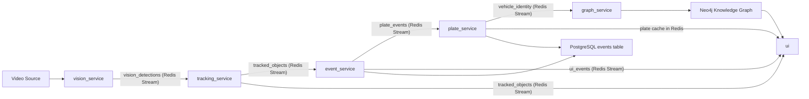

# Surveillance Tracker V2

## Executive Summary

Surveillance Tracker V2 is a multi-service video analytics platform designed to monitor vehicles from recorded or live camera feeds, assign stable track identities, detect operational events, resolve visible license plates, persist structured events, and build a relationship-driven knowledge graph for surveillance analysis.

The system evolved from a traffic-intelligence prototype into a surveillance-focused tracker. The current implementation prioritizes:

- live vehicle detection and tracking
- event generation for stopped and speeding vehicles
- plate recognition for eligible four-wheelers using cloud ANPR
- persistent event storage in PostgreSQL
- knowledge graph construction in Neo4j
- operator visibility through a Streamlit dashboard

## Business Objective

The platform aims to answer operational surveillance questions such as:

- Which vehicles were seen by a specific camera?
- When was a vehicle first and last observed?
- Was the vehicle stopped, moving, or speeding?
- Which vehicles repeatedly appeared in the scene?
- How can an operator visualize identities, sightings, and camera relationships?

## Scope

### In Scope

- single-camera surveillance processing from video or RTSP-style input
- object detection with YOLO
- multi-frame tracking with ByteTrack and stability enhancements
- event detection for stopped vehicles, speeding vehicles, and congestion
- plate recognition for visible four-wheelers
- event persistence in PostgreSQL
- vehicle-camera-sighting graph persistence in Neo4j
- operator dashboard in Streamlit

### Out of Scope

- multi-camera re-identification across distributed camera networks
- human face recognition
- forensic-grade evidence management
- guaranteed plate resolution under severe occlusion or extremely poor video quality
- production authentication and enterprise access control

## System Architecture

## Core Services

### 1. `vision_service`

Responsibilities:

- reads frames from `../data/traffic.mp4` or another source
- runs YOLO-based object detection
- encodes the current frame as base64 JPEG
- publishes frame detections to Redis stream `vision_detections`

Key outputs:

- `camera_id`
- `frame_id`
- `timestamp`
- `detections`
- `frame`

### 2. `tracking_service`

Responsibilities:

- consumes `vision_detections`
- converts detections into tracked objects
- applies ByteTrack plus custom stable-ID logic
- publishes tracked frame objects to `tracked_objects`

Tracking improvements implemented:

- same-frame duplicate suppression
- confidence filtering
- stable ID remapping on top of ByteTrack
- class-family matching for four-wheelers so a detector flip between `car`, `bus`, and `truck` does not automatically force a new identity
- extended reuse using IoU and center-distance thresholds

### 3. `event_service`

Responsibilities:

- consumes `tracked_objects`
- keeps short per-track history in Redis
- estimates motion and speed
- detects:
  - `vehicle_stopped`
  - `vehicle_speeding`
  - `traffic_congestion`
- inserts events into PostgreSQL
- publishes UI events to `ui_events`
- publishes plate recognition requests to `plate_events`

Important design choice:

- plate requests are issued for eligible four-wheelers regardless of whether they are moving or stopped
- motion status is carried as metadata, not used as a hard block

### 4. `plate_service`

Responsibilities:

- consumes `plate_events`
- buffers snapshots per `track_id`
- selects the best available snapshot per retry cycle
- calls ANPR to resolve a plate
- caches the result in Redis under `plate:{track_id}`
- updates the PostgreSQL `events` row with the plate
- publishes `vehicle_identity` after a successful confirmation

Important design choice:

- the final working path uses cloud ANPR
- a local detector plus OCR path was explored but proved less reliable for the available footage

### 5. `graph_service`

Responsibilities:

- consumes `vehicle_identity`
- writes vehicle identity facts into Neo4j
- creates:
  - `Vehicle`
  - `Camera`
  - `Sighting`
- creates relationships:
  - `OBSERVED_AS`
  - `AT_CAMERA`
  - `SEEN_AT`

This service was intentionally changed from reading `tracked_objects` to reading `vehicle_identity` because the earlier design raced against late-arriving plate resolution.

### 6. `ui`

Responsibilities:

- renders live annotated video
- shows latest events
- shows tracked objects and resolved plates
- reads graph insights from Neo4j
- displays vehicle sightings in GMT

## Data Stores

### Redis

Purpose:

- live stream transport
- low-latency cross-service communication
- short-lived plate cache
- short-term event and request throttling

Important streams:

- `vision_detections`
- `tracked_objects`
- `plate_events`
- `ui_events`
- `vehicle_identity`

Important keys:

- `plate:{track_id}`
- event deduplication keys
- plate request deduplication keys

### PostgreSQL

Purpose:

- structured event persistence

Main table:

- `events`

Important columns:

- `camera_id`
- `track_id`
- `event_type`
- `plate`
- `frame_id`
- `event_metadata`
- `created_at`

### Neo4j

Purpose:

- relationship-centric storage for surveillance knowledge

Node labels:

- `Vehicle`
- `Camera`
- `Sighting`

Relationship types:

- `OBSERVED_AS`
- `AT_CAMERA`
- `SEEN_AT`

## Runtime Flow

### Step-by-Step

1. A frame is read by `vision_service`.
2. YOLO detections are generated and streamed into Redis.
3. `tracking_service` consumes detections and assigns stable IDs.
4. `event_service` computes motion behavior and writes events.
5. `event_service` publishes plate requests for eligible four-wheelers.
6. `plate_service` buffers snapshots and performs ANPR on selected frames.
7. After plate confirmation, `plate_service`:
   - updates Redis cache
   - updates PostgreSQL events
   - publishes `vehicle_identity`
8. `graph_service` consumes `vehicle_identity` and writes graph entities.
9. `ui` reads from Redis and Neo4j to render operational state.

## Infrastructure

The system uses the following Dockerized backing services from `infra/docker-compose.yml`:

- Redis on `6379`
- PostgreSQL on `5432`
- Neo4j on `7474` and `7687`

PostgreSQL is configured with UTC timezone through Docker command options.

## Startup Model

Primary orchestrator:

- `runner/run_pipeline.py`

Startup sequence:

1. initialize Redis consumer group
2. start `vision_service`
3. start `tracking_service`
4. start `plate_service`
5. start `event_service`
6. start `graph_service`
7. start Streamlit UI

## Current Product Positioning

The project should now be described as a **surveillance tracker** rather than a generic traffic system.

Reason:

- its strongest value lies in identity-linked monitoring
- it records vehicle sightings, graph relationships, and plate-based surveillance context
- the current evolution moved beyond pure traffic counting

## Recent Major Enhancements

### Surveillance-Oriented Repositioning

- shifted framing from traffic analytics to surveillance tracking
- updated dashboard copy and operational workflows accordingly

### Plate Recognition Rework

- moved away from OCR on arbitrary whole-vehicle crops
- filtered plate attempts to eligible four-wheelers
- added per-track snapshot buffering and retry control
- integrated cloud ANPR for the successful path
- published confirmed identities into a dedicated stream

### Tracking Stability Improvements

- added stable-ID layer above ByteTrack
- reduced ID fragmentation caused by class jitter and duplicate detections
- expanded matching tolerance for noisy low-quality video

### Knowledge Graph Upgrade

- graph moved from weak `Vehicle -> Camera` edges to:
  - `Vehicle -> Sighting -> Camera`
- dashboard now surfaces graph-backed sightings with GMT timestamps

## Challenges Faced and Resolutions

### 1. Plate OCR Was Reading the Wrong Region

Problem:

- OCR was often receiving weak or irrelevant vehicle crops

Resolution:

- moved plate logic toward per-track buffered selection and ANPR-based reading

### 2. Plate Recognition Trigger Timing Was Too Narrow

Problem:

- plate reads initially depended too heavily on event conditions

Resolution:

- changed event logic to request plates for eligible four-wheelers across both moving and stopped states

### 3. Runtime Confusion Due to Multiple Python Environments

Problem:

- services were sometimes running from mixed interpreters, causing stale behavior and inconsistent debugging

Resolution:

- standardized operational runs around the project virtual environment and emphasized service restarts after code changes

### 4. ANPR Cloud Rate Limiting

Problem:

- free-tier API throttling produced `429 Too Many Requests`

Resolution:

- added global request spacing
- added retry backoff
- reduced retries to one best snapshot per attempt
- introduced per-track cooldown frames

### 5. Knowledge Graph Was Empty Even When Plates Were Working

Problem:

- graph service originally consumed `tracked_objects`, but plates were often not available at that exact moment

Resolution:

- added `vehicle_identity` stream from `plate_service`
- made `graph_service` consume plate-confirmed events instead of guessing from tracking timing

### 6. Track Fragmentation in Crowded Scenes

Problem:

- the same vehicle sometimes received multiple track IDs

Resolution:

- introduced stable-ID mapping
- handled same-family vehicle classes together
- suppressed overlapping duplicate detections

### 7. Invalid Plate Strings Being Stored

Problem:

- short noisy outputs could be cached as if they were real plates

Resolution:

- added normalization and validation rules before storing a plate

## Security and Operational Notes

- ANPR token should be supplied from environment variables in production
- `.env`, debug outputs, and model weights should remain outside normal source control
- Neo4j and PostgreSQL default credentials are acceptable for local development only

## Testing and Validation Notes

Practical validation methods used during development:

- live Redis stream inspection
- direct Neo4j query checks
- ANPR response inspection through runtime logs
- dashboard verification of plate and graph visibility
- syntax validation with `python -m py_compile`

## Known Limitations

- occluded vehicles can still inherit incorrect plates temporarily
- same-scene vehicles with severe overlap can still fragment into multiple tracks
- free-tier ANPR rate limits constrain throughput
- graph currently focuses on vehicle-camera-sighting relationships, not advanced temporal reasoning

## Recommended Next Steps

- add watchlist support for high-priority plates
- enrich graph with event nodes such as `SpeedingEvent` and `StopEvent`
- support multi-camera reappearance correlation
- add operator controls for replay, search, and investigation workflows

